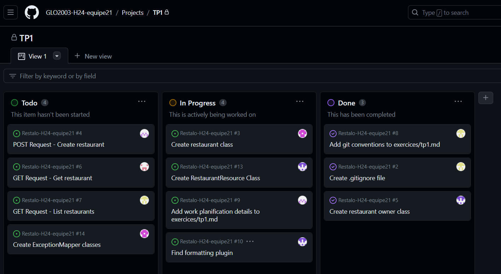
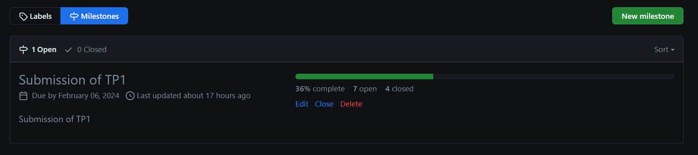
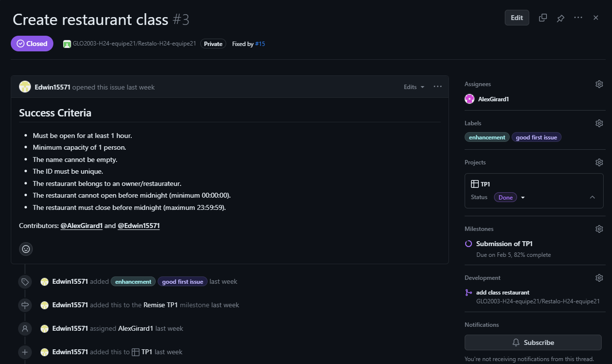
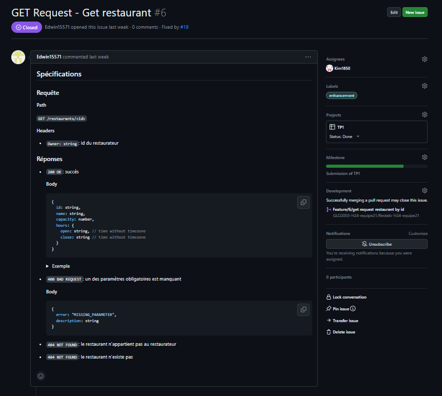
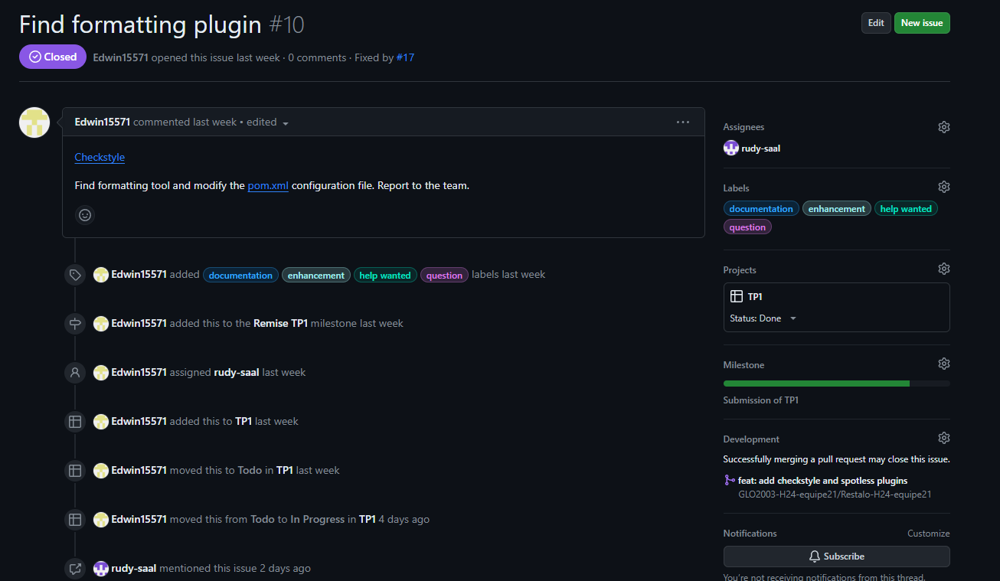
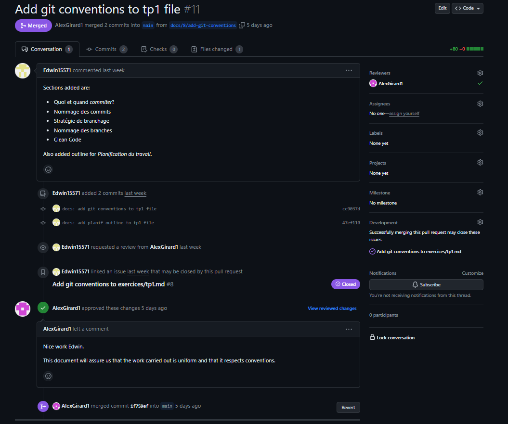
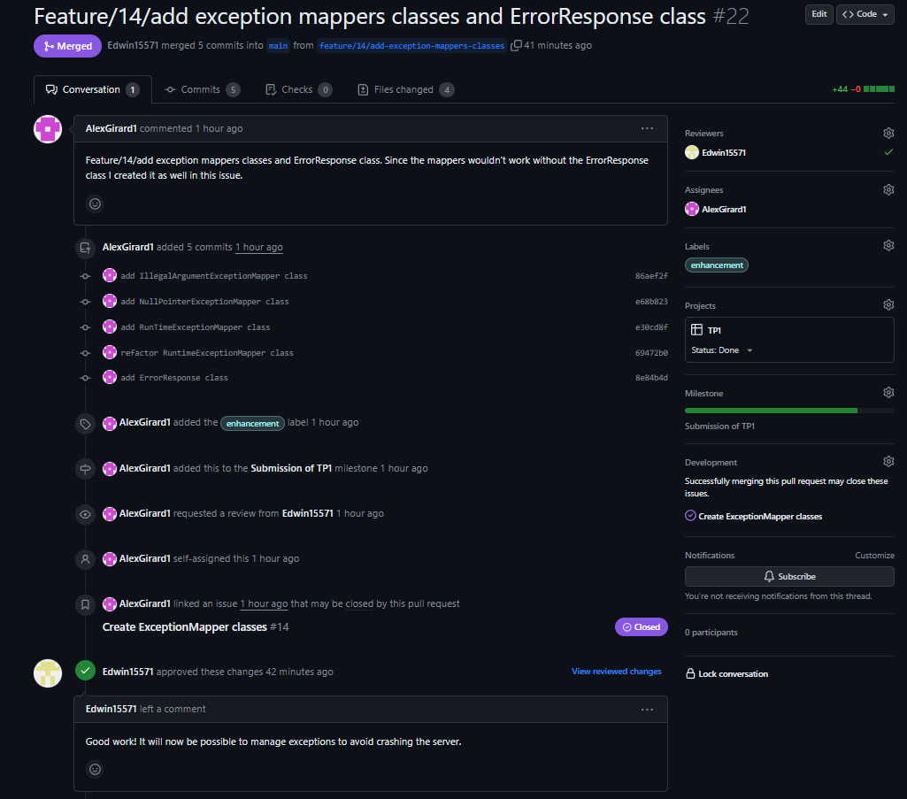
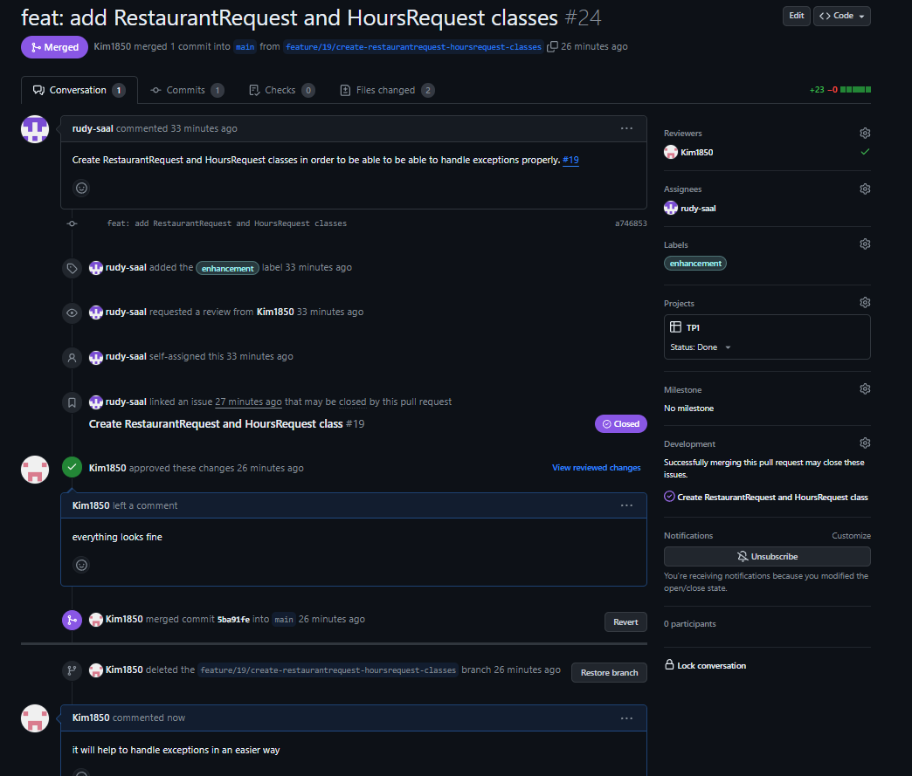

# Exercices - TP1

## Conventions Git

### Quoi et quand *commiter*?

Dans notre équipe, nous privilégions les petits commits fréquents plutôt que les gros commits occasionnels. Chaque commit doit représenter une partie de travail qui est fonctionnelle. Afin de garder un historique clair et précis de l'avancement du projet, nous recommandons de ne pas englober de nombreuses fonctionnalités distinctes dans un seul et même commit.

### Nommage des commits

Nous nous inspirons de [Conventional Commits](https://www.conventionalcommits.org/en/v1.0.0/#summary) pour la nomenclature de nos commits. Plus spécifiquement, nos messages sont structurés comme suit :

    <type>[optional scope]: <description>

Voici les types utilisés et leurs utilités:

- **`fix`**: Afin de résoudre un *bug* dans le code.
- **`feat`**: Pour introduire une nouvelle *feature* dans le code.
- **`docs`**: Afin d'ajouter de la documentation.
- **`refactor`**: Lorsque le code est restructuré/retravaillé.
- **`test`**: Pour ajouter des tests au code.

L'attribut optionnel `scope` fait référence à un mot qui fournit de l'information contextuelle supplémentaire. Celui-ci est mis entre parenthèses et doit décrire une section du code.

Enfin, la description est une courte phrase décrivant le motif du commit. Elle commence généralement par un verbe à l'infinitif, ne commence pas par une majuscule et ne termine pas par un point.

Voici quelques exemples tirés de Conventional Commits:

    feat(lang): add Polish language
    fix: prevent racing of requests
    docs: correct spelling of CHANGELOG

### Stratégie de branchage

Cette session, nous employons une stratégie de branchage qui s'inspire de [GitHub Flow](https://githubflow.github.io/) et [GitLab Flow](https://about.gitlab.com/topics/version-control/what-is-gitlab-flow/). La voici plus en détail:

1. Notre répertoire contient deux branches de base: `main` et `production`. La branche `main` est notre endroit de travail. C'est à partir de cette branche que nous créons d'autres branches afin d'implémenter de nouvelles fonctionnalités ou de résoudre des *bugs*. Une fois que le code contenu sur `main` est prêt à être déployé, celui-ci est intégré à la branche `production`, qui regroupe le code officiel, testé et fonctionnel de notre application.
2. Notre branche principale est `production`, puisqu'elle contient le code et la documentation pouvant être remis. De plus, c'est elle qui possède les *tags* de remise des différentes parties du projet.
3. Comme la stratégie GitHub Flow, nous choisissons de créer une nouvelle branche à partir de `main` à chaque fois que nous travaillons sur quelque chose de nouveau. Ainsi, une nouvelle branche sera créée pour chacune des *issues* en cours de progression. Pour plus de détails sur la nomenclature des branches, voir [Nommage des branches](#nommage-des-branches).
4. Une fois qu'un développeur a complété l'*issue* qui lui est attitrée, il peut faire une *pull request* afin d'intégrer son code à celui de la branche `main` (l'espace de travail). Nous utilisons la commande *merge* plutôt que *rebase* pour toute fusion de branches dans notre répertoire. Notre équipe étant relativement petite, nous considérons que cette option est plus simple.

### Nommage des branches

Selon la situation, une branche peut être créée pour développer une nouvelle *feature*, résoudre un *bug* en environnement de travail ou en environnement de production, etc. Ainsi, afin d'assurer une cohérence au sein de l'équipe, nous adoptons la structure suivante pour nommer nos branches:

    <prefix>/<issue-number>/<description>

Les préfixes disponibles sont:

1. **`feature`**: Lors de l'ajout d'une fonctionnalité au code.
2. **`bugfix`**: Lorsqu'il y a un *bug* à résoudre dans l'environnement de travail (branche `main`).
3. **`hotfix`**: Au cas où il y a un *bug* à corriger très rapidement sur une version du code en production (branche `production`).
4. **`docs`**: Lorsque les ajouts sont de la documentation.

Le paramètre `issue-number` correspond au numéro de l'*issue* associée à la branche.

La description de la branche devrait comporter quelques mots qui décrivent succinctement le travail réalisé sur cette branche. La description est composée de caractères alphanumériques minuscules et chaque mot est séparé par un trait d'union.

Voici quelques exemples suivant les conventions nommées précédemment:

    feature/12/improved-ui-login
    bugfix/8/fix-api-response-time
    docs/2/add-exercices-tp1

**Source** : [Naming conventions for Git Branches - a Cheatsheet](https://medium.com/@abhay.pixolo/naming-conventions-for-git-branches-a-cheatsheet-8549feca2534#:~:text=Basic%20Rules,0%E2%80%939).

## Clean Code

Nous utilisons l'outil [Checkstyle](https://checkstyle.sourceforge.io/version/8.20/index.html) afin de vérifier le formatage de notre code automatiquement. La configuration appliquée est celle de [Google Java Style](https://google.github.io/styleguide/javaguide.html).

## Planification du travail

### GitHub Project

### Milestone

### Issues
Issue 3

Issue 6

Issue 10

### Pull requests
pull-request 3

pull-request 22

pull-request 24

### Arbre de commits
