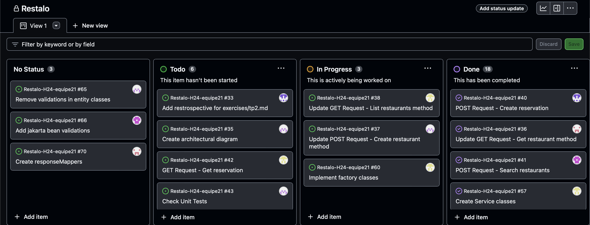
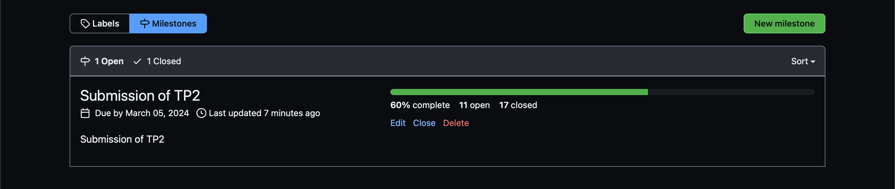
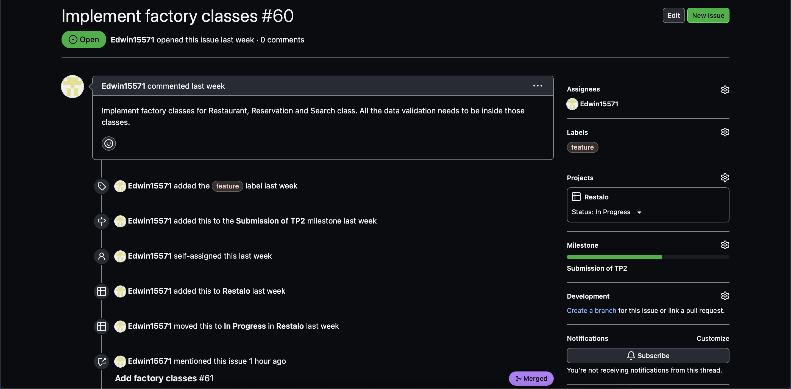
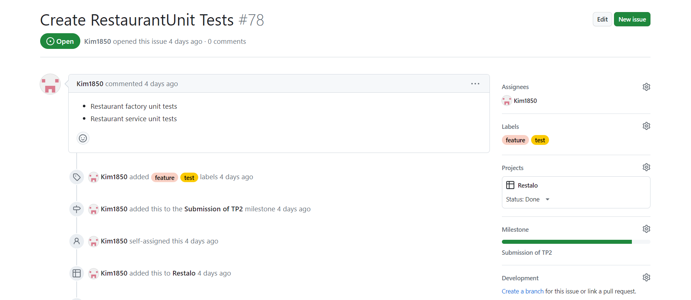
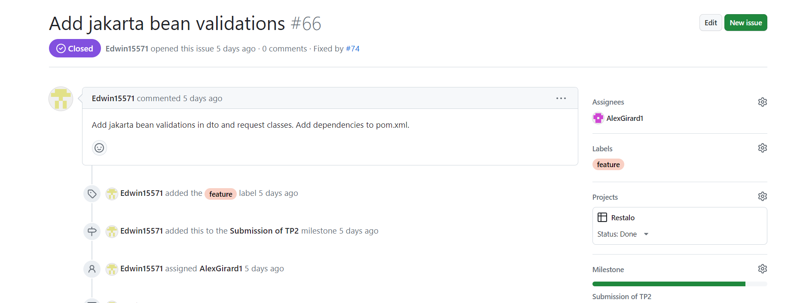
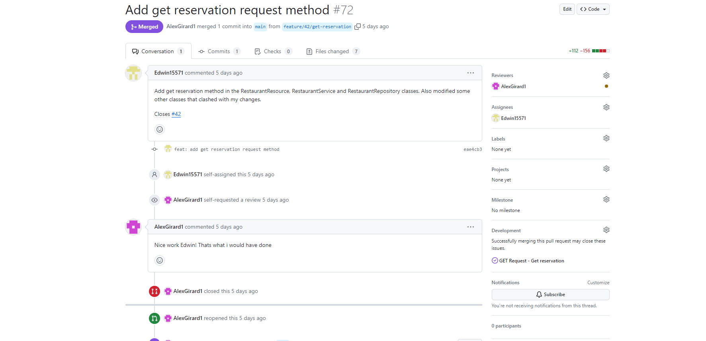
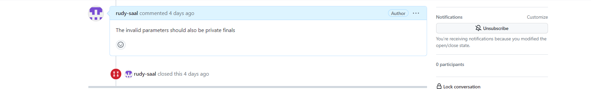
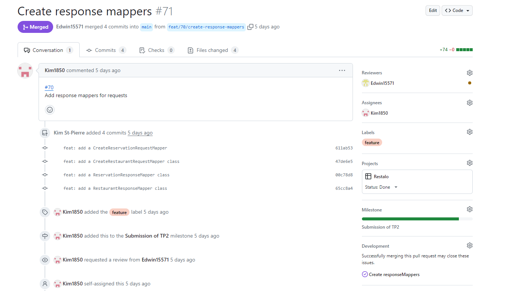
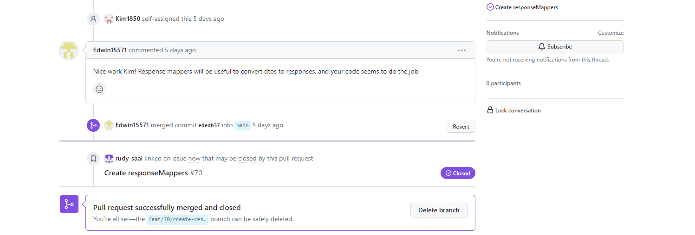
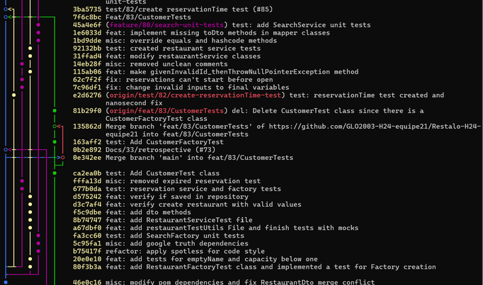

# Exercices - TP2

## Rétrospective sur le processus

|                                                | Moyenne | Minimum | Maximum |
|------------------------------------------------|---------|---------|---------|
| Temps pour implémenter une issue               | 2 jours | 1h      | 2 sem   |
| Temps pour intégrer pull-request               | 1 jour  | 15 min  | 3 jours |
| Nombre de personnes par issue                  | 1       | 1       | 1       |
| Reviewers par pull-request                     | 1       | 1       | 2       |
| Nombre d'issues intégré en même temps          | 4       | 0       | 5       |
| Nombre de pull-request en review en même temps | 1       | 0       | 2       |

1. Selon nous, les issues et pull-requests prenaient parfois trop de temps à être terminées. Les issues prenaient souvent de temps quand qu'on manquait
les informations nécessaires pour avancer l'issue. Les pull-requests prenaient trop de temps lorsque quand la personne en charge de faire le review
était occupée et  le review ne se faisait pas assigné à une autre personne. Idéalement, chacun ne devrait pas prendre plus qu'une journée à se faire,
vu que le lot de travail n'était pas immense. Par contre, lorsqu'un issue était relativement plus grand que les autres, il était attendu que ça prenne
plus de temps pour le soumettre et faire son review.

2. Le lien entre la taille des issues et pull-requests et le temps que ça prenait à les terminer est très intuitif: plus que l' issue est grand, plus que
ça va prendre du temps pour le compléter. Si un membre de l'équipe a un issue plus complexe, ça lui prendra beaucoup de temps à coder toutes les fonctionnalités
associés et le reviewer de son pull-request prendra également plus de temps pour vérifier que son code est bien fait. Inversement, un issue très simple ne prendra
pas beaucoup de temps à compléter et à vérifier en pull-request. Donc, le lien entre la taille des issues et pull-requests et le temps que ça prend à les terminer est
proportionnel.

3. Il y a plusieurs façons qu'on pourrait améliorer notre processus. Premièrement, nous pourrions réduire la grandeur de nos issues pour les compléter plus souvent.
Ceci permettra d'avancer notre projet plus efficacement parce que les autres membres de l'équipe n'aurait pas à attendre longtemps pour des fonctionnalités qu'un autre
membre a déjà complété à l'intérieur de son grand issue. Deuxièmement, pour assurer de faire passer des pull-requests plus souvent, on pourrait assurer de bien aviser
les membres de l'équipe quand il faut faire un review. Dernièrement, afin de mieux travailler en équipe, nous pourrions faire plus souvent du peer-programming pour
assurer que les autres membres comprennent mieux le processus et les stratégies de la personne qui ajoute du code.

## Architecture

Ci-dessous se trouve une représentation graphique de l'architecture de Restalo. Nous avons séparé les diagrammes en fonction des différentes fonctionnalités de l'API. Comme il est possible d'effectuer 7 requêtes, 7 diagrammes sont présentés.

L'architecture est divisée en trois couches: client (api), modèle d'affaire (domain) et persistance (data). Nous nous sommes très fortement inspiré de la structure du répertoire [Utournament](https://github.com/glo2003/UTournament) présenté en classe.
Voici une brève description du rôle des classes principales :

- **API**
  - Les classes de type `Request` telles que `CreateRestaurantRequest` et `CreateReservationRequest` représentent les *body* des requêtes qui peuvent être envoyés par l'utilisateur. Ce sont des DTO qui peuvent contenir des annotations `jakarta` afin d'exiger ou non la présence d'un attribut.
  - Les classes de type `Mapper` comme `RestaurantResponseMapper` convertissent les objets DTO du domaine en objet `Response`. Ils peuvent masquer certains attributs des DTOs selon la réponse à envoyer.
  - Les classes de type `Response` représentent les *body* des réponses qui peuvent être envoyées à l'utilisateur lorsqu'il fait une requête `GET`, par exemple.
  - Les classes `Resource` sont les points d'entrée des requêtes de l'utilisateur. Elles utilisent diverses fonctionnalités de la librairie `Jersey` pour y arriver. Elles communiquent avec les classes `Services` du domaine.
- **DOMAIN**
  - Les classes finissant par `Dto` représentent les entités du domaine sous une forme moins complexe. Ce sont ces objets qui sont envoyés à la couche *api* et qui permettent donc la communication entre les deux couches *api* et *domain*.
  - Les classes telles que `Restaurant`, `Reservation` ou `Customer` sont les classes représentant les entités du domaine.
  - Les classes `Factory` permettent de créer des entités. Elles valident les arguments et soulèvent des exceptions lorsque des champs ne sont pas valides.
  - Les classes `Mapper` du domaine convertissent les objets complexes du domaine (les entités) en DTOs.
  - Les classes `SearchService`, `RestaurantService` et `ReservationService` sont au centre de l'application et servent d'interface entre l'utilisateur et la base de données. Chaque classe `Service` reçoit des informations des classes `Resource` et les utilisent pour communiquer aux classes `Repository`.
- **DATA**
  - `RestaurantRepository` est la classe qui sauvegarde les restaurants dans la mémoire (une `Map` Java pour l'instant). Elle offre aussi des méthodes permettant de chercher des restaurants selon certains critères ou encore d'obtenir un restaurant par son id.
  - `ReservationRepository` est la classe qui sauvegarde les réservations dans la mémoire. Seules les méthodes d'ajout et d'obtention d'une réservation sont présentes pour l'instant.
  - Ces deux classes renvoient des objets aux classes `Service` de la couche du domaine.

Il
## Planification du travail

### GitHub Project

### Milestone

### Issues
Issue #1

Issue #2

Issue #3

### Pull requests

Pull request #1

Pull request #2

Pull request #3

### Arbre de commits

