# Exercices - TP2

## Rétrospective sur le processus

|                                                  | Moyenne | Minimum | Maximum |
|--------------------------------------------------|---------|---------|---------|
| Temps pour implémenter une _issue_               | 2 jours | 1h      | 2 sem   |
| Temps pour intégrer _pull-request_               | 1 jour  | 15 min  | 3 jours |
| Nombre de personnes par _issue_                  | 1       | 1       | 1       |
| Reviewers par _pull-request_                     | 1       | 1       | 2       |
| Nombre d'_issues_ intégré en même temps          | 4       | 0       | 5       |
| Nombre de _pull-request_ en review en même temps | 1       | 0       | 2       |

1. Selon nos observations, le temps nécessaire pour compléter les issues et les pull-requests était parfois trop 
   long. Par exemple, la durée des _issues_ pouvaient s'étendre sur plusieurs jours lorsque la personne en charge 
   manquait d'information ou de temps pour la finaliser. De plus, si le responsable de la revue d'une _pull-request_ 
   n'était pas disponible ou ne léguait pas cette responsabilité à quelqu'un d'autre, celles-ci pouvaient rester en 
   attente de revue pendant une période prolongée. En temps normal, nous considérons que la réalisation d'une 
   _issue_ ou d'une _pull-request_ ne devrait pas être de plus d'un jours, puisque le lot de travail n'est pas 
   immense. Toutefois, dans le cas où l'_issue_ est relativement plus grande que les autres, il est attendu que sa 
   soumission et sa revue prennent davantage de temps.

2. Le lien entre la taille des _issues_ et des _pull-requests_ et la durée nécessaire pour les finaliser est intuitif: 
   plus l'_issue_ est grande et plus le temps requis pour sa réalisation et sa revue sera long. Si un membre de 
   l'équipe s'attribue une _issue_ plus complexe, il lui faudra davantage de temps pour coder toutes les 
   fonctionnalités qui lui sont associée. Conséquemment, la revue de celle-ci sera prolongée afin de garantir la 
   qualité du code produit. Inversement, une _issue_ simple sera complétée et passée en revue plus rapidement. Ainsi, 
   le lien entre la taille du travail à réaliser et le temps à les terminer est proportionnel.

3. Plusieurs pistes d'améliorations s'offrent à nous en ce qui concerne notre processus. Premièrement, nous 
   pourrions réduire la taille de nos _issues_ afin de les compléter plus régulièrement. Ceci nous permettrait 
   d'avancer le projet plus efficacement, car les membres de l'équipe n'aurait pas à attendre trop longtemps pour 
   accéder aux fonctionnalités implémentées par un autre membre. Deuxièmement, dans le but d'assurer une fréquence de 
   revue plus régulière des _pull-requests_, nous pourrions informer les membres de l'équipe dès qu'une revue est 
   sollicitée. Enfin, en vue d'une meilleure collaboration au sein de l'équipe, nous pourrions favoriser les séances 
   de _peer-programming_ qui peuvent être un excellent milieu de partage de connaissances en programmation et en 
   processus logiciel.

## Architecture

Ci-dessous se trouve une représentation graphique de l'architecture de Restalo. Nous avons séparé les diagrammes en
fonction des différentes fonctionnalités de l'API. Comme il est possible d'effectuer six requêtes, six diagrammes sont
présentés.

L'architecture est divisée en trois couches: client ([api](#api)), modèle d'affaire ([domain](#domain)) et
persistance ([data](#data)). Étant donné notre manque d'expérience en développement d'API, nous nous sommes très
fortement inspiré de la structure du répertoire [Utournament](https://github.com/glo2003/UTournament) présenté en 
classe. Voici une brève description du rôle des classes principales :

### API

- Les classes de type `Request` telles que `CreateRestaurantRequest` et `CreateReservationRequest` représentent les
  *body* des requêtes qui peuvent être envoyés par l'utilisateur. Ce sont des DTO qui peuvent contenir des
  annotations `jakarta` afin d'exiger ou non la présence d'un attribut.
- Les classes de type `Mapper` comme `RestaurantResponseMapper` convertissent les objets DTO du domaine en
  objet `Response`. Ils peuvent masquer certains attributs des DTOs selon la réponse à envoyer.
- Les classes de type `Response` représentent les *body* des réponses qui peuvent être envoyées à l'utilisateur lorsqu'
  il fait une requête `GET`, par exemple.
- Les classes `Resource` sont les points d'entrée des requêtes de l'utilisateur. Elles utilisent diverses
  fonctionnalités de la librairie `Jersey` pour y arriver. Elles communiquent avec les classes `Services` du domaine.

### DOMAIN

- Les classes finissant par `Dto` représentent les entités du domaine sous une forme moins complexe. Ce sont ces objets
  qui sont envoyés à la couche *api* et qui permettent donc la communication entre les deux couches *api* et *domain*.
- Les classes telles que `Restaurant`, `Reservation` ou `Customer` sont les classes représentant les entités du domaine.
- Les classes `Factory` permettent de créer des entités. Elles valident les arguments et soulèvent des exceptions
  lorsque des champs ne sont pas valides.
- Les classes `Mapper` du domaine convertissent les objets complexes du domaine (les entités) en DTOs.
- Les classes `SearchService`, `RestaurantService` et `ReservationService` sont au centre de l'application et servent d'
  interface entre l'utilisateur et la base de données. Chaque classe `Service` reçoit des informations des
  classes `Resource` et les utilisent pour communiquer aux classes `Repository`.

### DATA

- `RestaurantRepository` est la classe qui sauvegarde les restaurants dans la mémoire (une `Map` Java pour l'instant).
  Elle offre aussi des méthodes permettant de chercher des restaurants selon certains critères ou encore d'obtenir un
  restaurant par son id.
- `ReservationRepository` est la classe qui sauvegarde les réservations dans la mémoire. Seules les méthodes d'ajout et
  d'obtention d'une réservation sont présentes pour l'instant.
- Ces deux classes renvoient des objets aux classes `Service` de la couche du domaine.

Nous notons principalement deux points à améliorer quant à l'organisation de notre projet et son architecture pour 
la suite des travaux pratiques. D'abord, il n'est pas sécuritaire que les classes `Service` de la couche du 
domaine ait directement accès aux classes `Repository` de la couche des données. Il serait préférable d'employer une 
interface afin de masquer certaines fonctionnalités des classes`Repository` aux classes `Services` qui ne les 
utilisent pas. Ensuite, pour répondre à certaines fonctionnalités du système, il semble y avoir une surabondance de 
classes d'impliquées. Par exemple, la simple création d'une réservation nécessite la collaboration de plus d'une 
dizaine de classes. Toutefois, cette approche nous permet de conserver des classes plus petites, ce qui respecte l'un 
des principes fondamental du Clean Code:
> "_The first rule of classes is that they should be small. The second rule of classes is that they should be smaller 
than that._" - Robert C. Martin

### Créer un restaurant

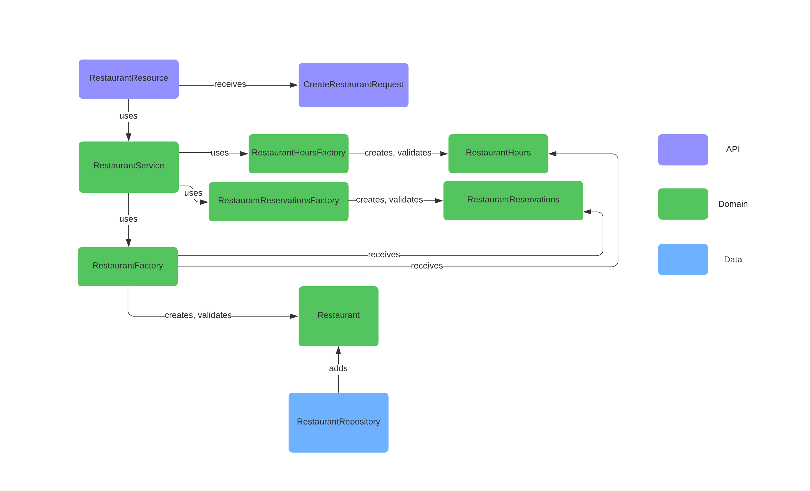

### Obtenir un restaurant

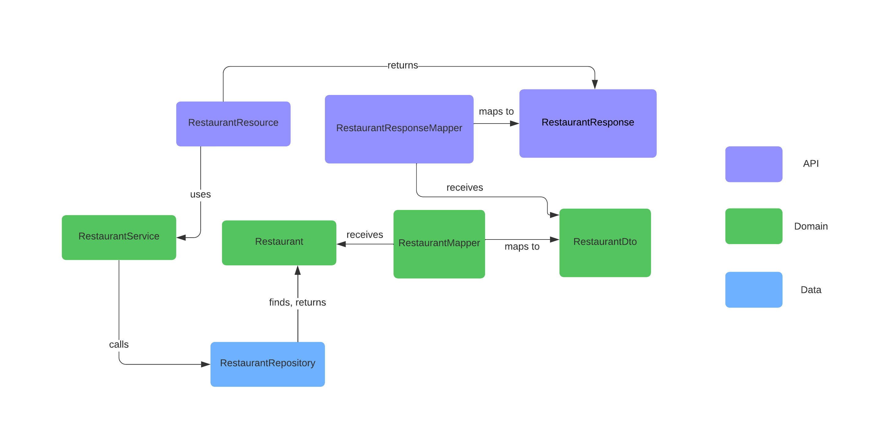

### Lister des restaurant

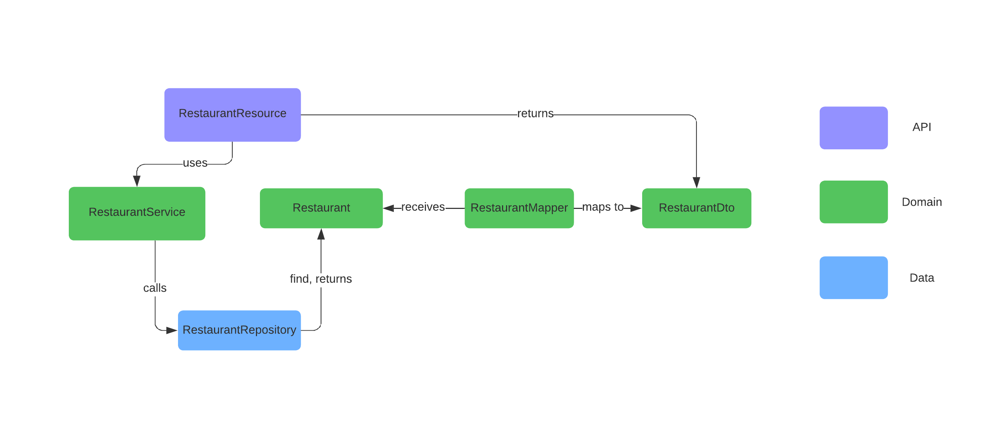

### Rechercher des restaurants

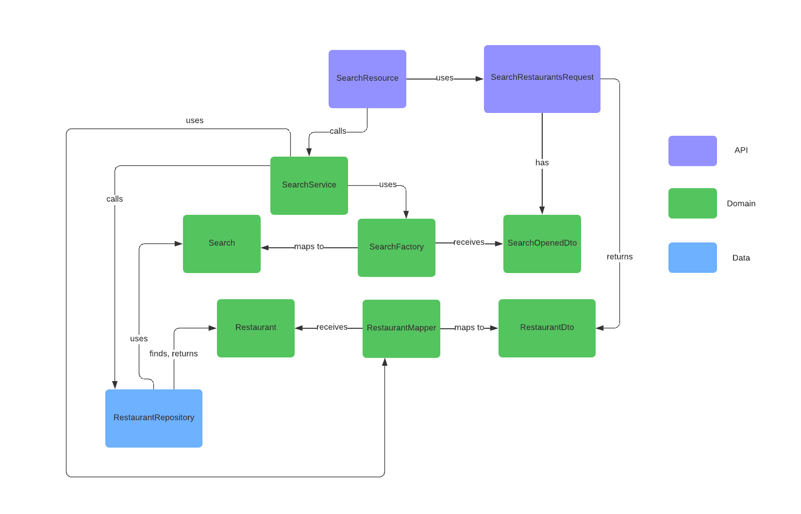

### Créer une réservation

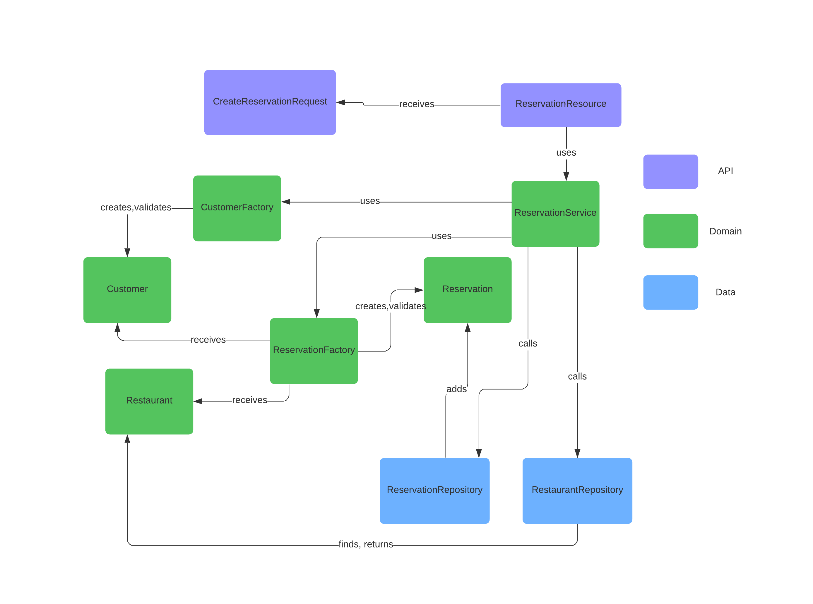

### Obtenir une réservation

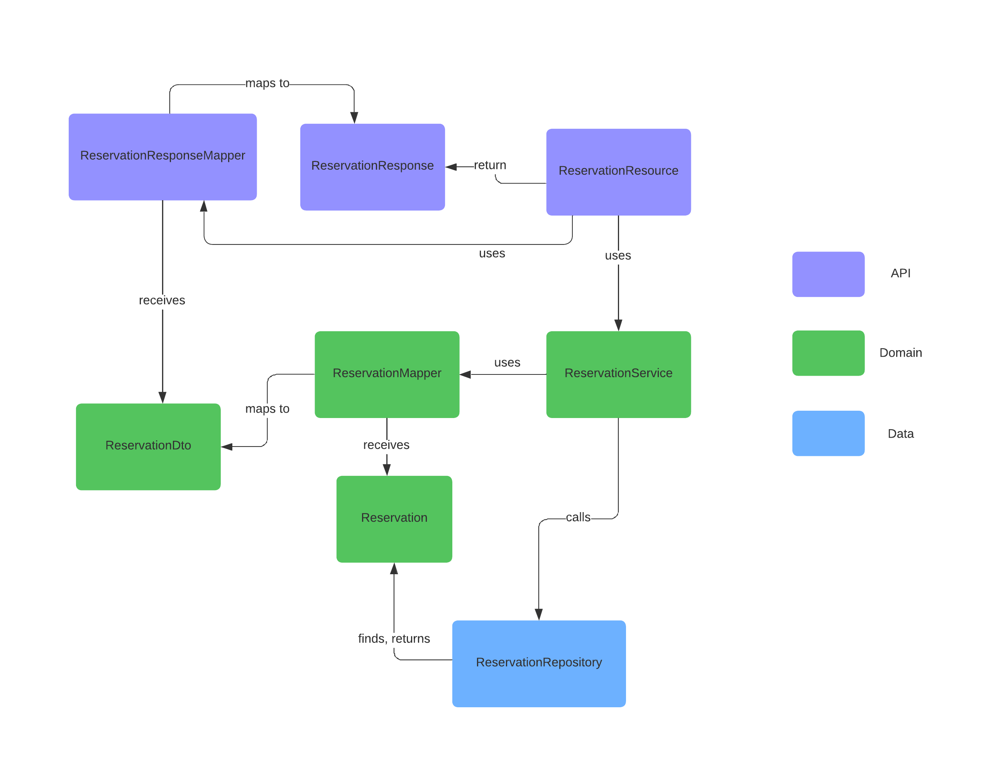

## Planification du travail

### GitHub Project

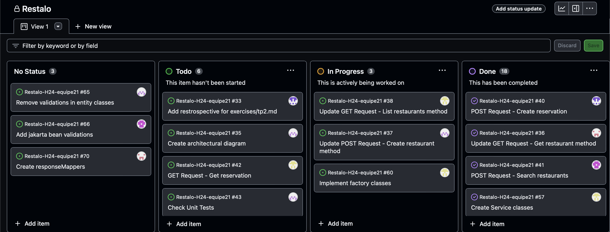

### Milestone

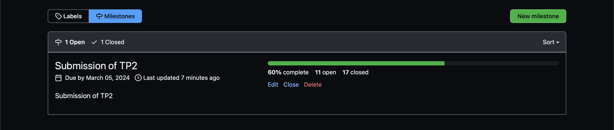

### Issues

Issue #1
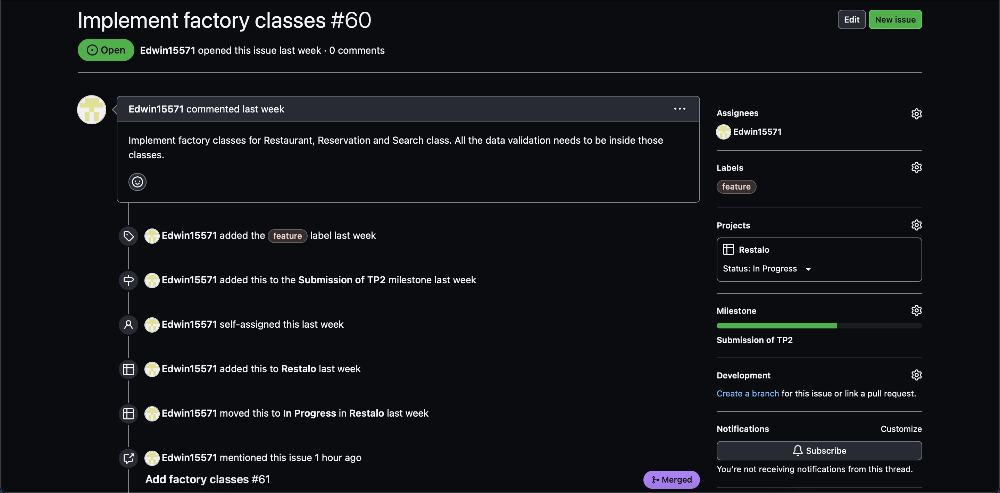

Issue #2
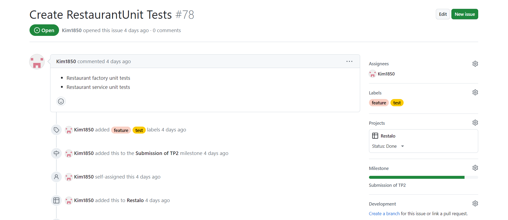

Issue #3
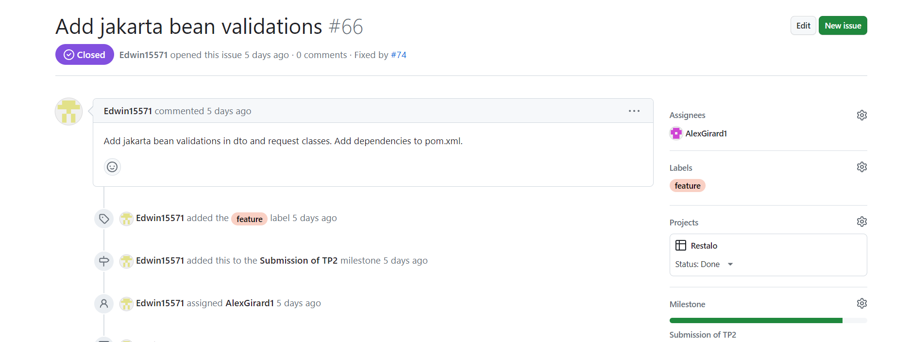

### Pull requests

Pull request #1
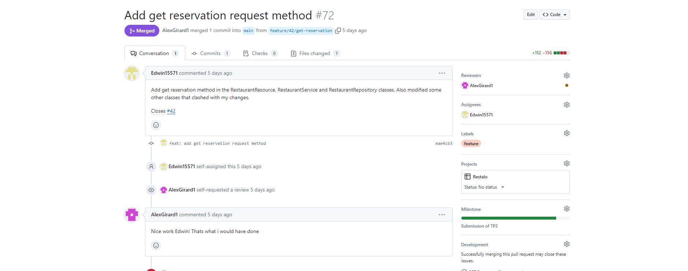
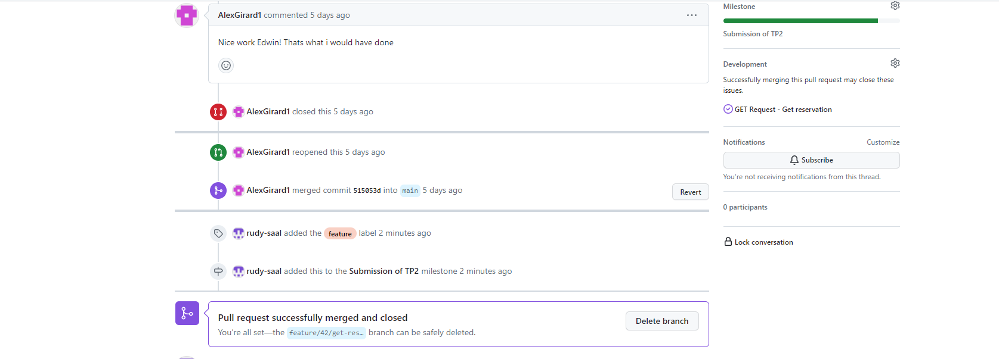

Pull request #2
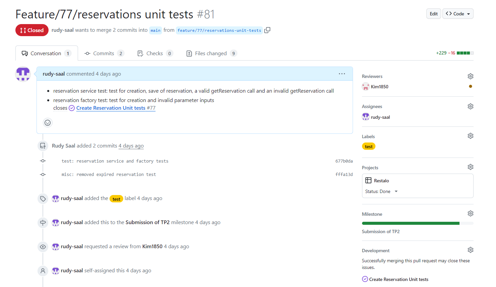
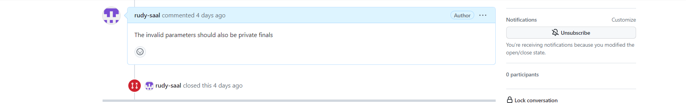

Pull request #3
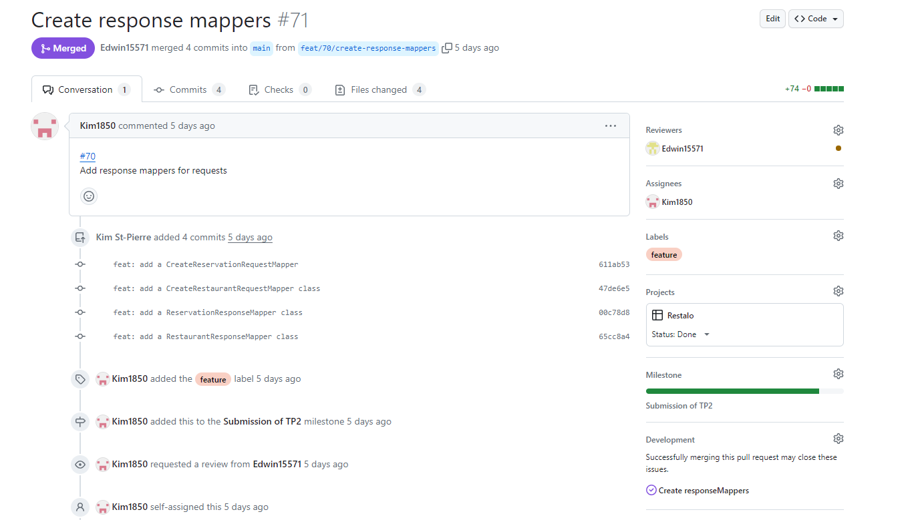
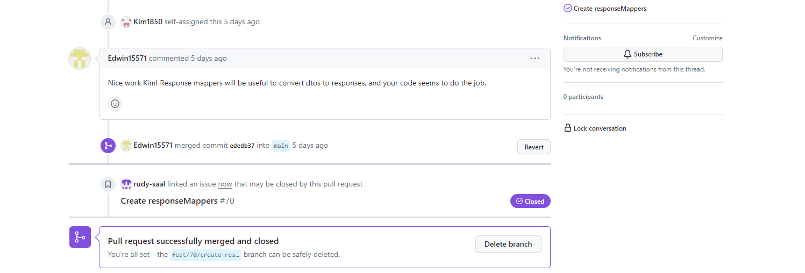

### Arbre de commits

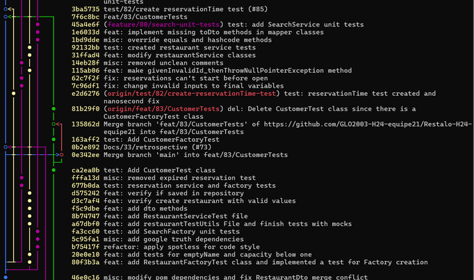