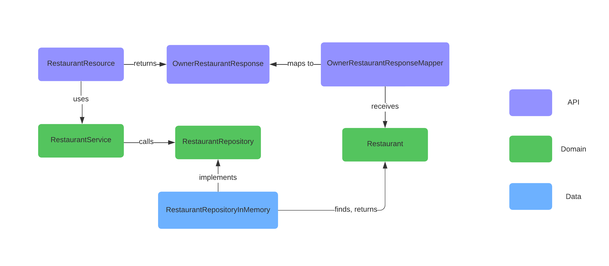
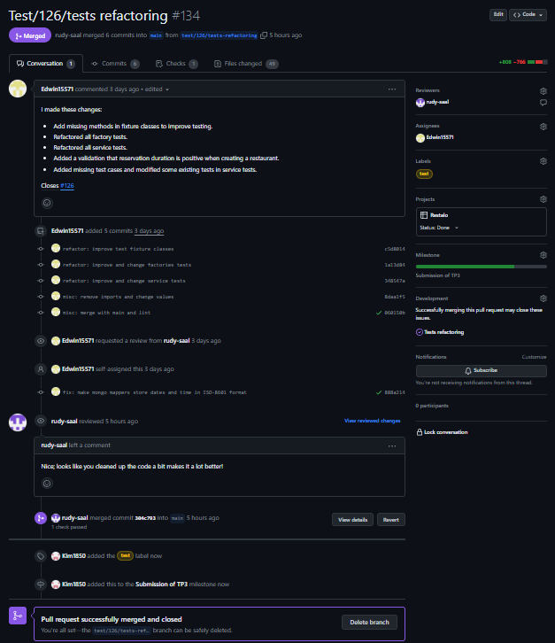

# Exercices - TP3

## Rétrospective - Intégration continue et tests

### Pipeline CI

1. Avant l'implémentation du pipeline de tests automatisés, nous consacrions de 10 à 30 minutes à la vérification de 
   notre code lors des intégrations et plusieurs heures lors des remises. Ces périodes de travail devaient donc être 
   planifiées et prévues à l'avance afin de ne pas manquer de temps.
2. Depuis l'implémentation du pipeline, nous consacrons environ 5 minutes à la validation de notre code lors des 
   intégrations et 2 à 3 heures au moment de la remise. C'est une réduction de temps 
   considérable et positive dans notre planification du travail.
3. Voici 3 points positifs démontrant les bénéfices de l'intégration continue sur notre processus. 
   - **Intégrations plus fréquentes** : Notre équipe intègre le nouveau code plus rapidement et à une 
     plus grande fréquence qu'avant dans le répertoire de travail.
   - **Rétroaction instantanée** : Le succès ou l'échec des tests automatisés offre une rétroaction instantanée à 
     celui ou celle qui implémente une nouvelle fonctionnalité. Les erreurs sont donc corrigées tôt dans le 
     projet.
   - **Uniformité du code** : Les inspections automatisées du code (_spotless_) permettent à l'équipe d'avoir un code 
     uniforme et formaté de la même manière en tout temps.
4. Le pipeline CI automatise certaines vérifications du code à l'aide de tests, mais il revient à l'équipe de 
   garantir la qualité et la couverture suffisante de ces tests. Sans cette vigilance, les tests qui réussissent lors 
   des intégrations de code pourraient ne pas être fiables. Ainsi, nous devons évaluer et réviser régulièrement 
   ces tests afin qu'ils conviennent aux besoins changeants du projet.

### Tests

1. À l'heure actuelle, nous passons 70 % de notre temps à implémenter du code fonctionnel et 30 % à implémenter des 
   tests unitaires, ce qui représente une grande amélioration par rapport au début du projet, où cette proportion 
   tournait aux alentours des 90 / 10. D'ici la fin du projet, nous aimerions atteindre un ratio équivalent entre 
   l'implémentation de code et de tests, car nous sommes conscients des bénéfices et de l'importance des tests dans 
   l'évaluation de la qualité du logiciel.
2. Avec l'implémentation des tests, la taille de nos _issues_ a naturellement augmenté, les rendant ainsi plus 
   longues à compléter par les membres de l'équipe. Les _pull-requests_ prennent elles aussi plus de temps à 
   approuver, étant donné que nous devons non seulement valider le code lui-même, mais aussi les tests qui lui sont 
   associés. Par ailleurs, au cours du deuxième travail pratique, nous avons ajouté des _issues_ afin de réaliser les
   tests d'intégration de certaines parties du système.
3. Notre niveau de confiance envers notre code s'est renforcé depuis l'ajout de tests. En effet, lors de 
   l'implémentation d'une nouvelle fonctionnalité au logiciel, il est simple et rapide de tester si ces ajouts
   n'endommagent pas les fonctionnalités existantes du système.
4. Pour améliorer l'état de nos tests, nous pouvons
   - Effectuer un _refactoring_ des tests afin qu'ils soient plus lisibles et compacts. L'utilisation de _fixtures_ 
     peut notamment aider dans ce contexte.
   - Valider la couverture des tests existants pour que l'ensemble des cas spécifiques des fonctions du programme 
     soient testés. Ajouter de nouveaux tests au besoin.
   - Faire des revues de tests chaque semaine afin de s'assurer que l'ensemble des tests soit mis à jour selon les 
     nouvelles fonctionnalités du système.

## Stories

Voici quelques idées pour le développement futur de la plateforme `restalo`. Ces idées sont développées sous la 
forme de récits utilisateur.

### Modifier une réservation

En tant que client, je peux modifier les paramètres de ma réservation.

#### Critères de succès

- Seul le créateur de la réservation peut modifier sa réservation.
- Seuls les paramètres que le client souhaite modifier sont spécifiés.
- Dans le cas où la date de réservation est modifiée, la nouvelle date doit être postérieure à la date initiale.
- Tous les autres critères de création d'une réservation s'appliquent. (voir **Créer une réservation**)

### Obtenir l'heure d'affluence du restaurant

En tant qu'utilisateur, je peux obtenir l'heure d'affluence d'un restaurant.

#### Critères de succès

- Le paramètre de date est obligatoire.
- S'il n'y a aucune réservation à la date spécifiée, aucun résultat n'est donné.
- L'heure d'affluence est donnée sous la forme d'un intervalle d'une heure. Par exemple :
  - 13h15 - 14h15.
  - 11h00 - 12h00.

### Ajouter une évaluation

En tant que client, je peux ajouter une évaluation au restaurant.

#### Critères de succès

- La note doit être comprise entre 0 et 5 inclusivement.
- Le commentaire ne peut pas être vide.
- Chaque évaluation est horodatée au moment de sa création.

### Rechercher des évaluations

En tant qu'utilisateur, je peux voir les évaluations d'un restaurant.

#### Critères de succès
- Il est possible de rechercher par note.
- Il est possible de rechercher par date.
- Si aucun paramètre n'est spécifié, toutes les évaluations du restaurant sont affichées.

## Architecture

Ci-dessous se trouve une représentation graphique de l'architecture de Restalo. Nous avons séparé les diagrammes en
fonction des différentes fonctionnalités de l'API. Comme il est possible d'effectuer six requêtes, six diagrammes sont
présentés.

L'architecture est divisée en trois couches: client ([api](#api)), modèle d'affaire ([domain](#domain)) et
persistance ([data](#data)). Étant donné notre manque d'expérience en développement d'API, nous nous sommes très
fortement inspiré de la structure du répertoire [Utournament](https://github.com/glo2003/UTournament) présenté en
classe. Voici une brève description du rôle des classes principales :

### API

- Les classes de type `Request` telles que `CreateRestaurantRequest` et `CreateReservationRequest` représentent les
  *body* des requêtes qui peuvent être envoyés par l'utilisateur. Ce sont des classes qui peuvent contenir des
  annotations `jakarta` afin d'exiger ou non la présence d'un attribut.
- Les classes de type `Mapper` comme `RestaurantResponseMapper` convertissent les entités du domaine en
  objet `Response`. Chaque type de réponse possède son *mapper* associé.
- Les classes de type `Response` représentent les *body* des réponses qui peuvent être envoyées à l'utilisateur lorsqu'
  il fait une requête `GET`, par exemple.
- Les classes `Resource` sont les points d'entrée des requêtes de l'utilisateur. Elles utilisent diverses
  fonctionnalités de la librairie `Jersey` pour y arriver. Elles communiquent avec les classes `Services` du domaine.

### DOMAIN

- Les classes telles que `Restaurant`, `Reservation` ou `Customer` sont les classes représentant les entités du domaine.
- Les classes `Factory` permettent de créer des entités. Elles valident les arguments et soulèvent des exceptions
  lorsque des champs ne sont pas valides.
- Les classes `SearchService`, `RestaurantService` et `ReservationService` sont au centre de l'application et servent d'
  interface entre l'utilisateur et la base de données. Chaque classe `Service` reçoit des informations des
  classes `Resource` et les utilisent pour communiquer aux interfaces `Repository`.

### DATA

- Dans les diagrammes ci-dessous, les classes stockant les données sont `RestaurantRepositoryInMemory` et 
  `ReservationRepositoryInMemory`. À noter qu'il existe des variantes à ces classes qui permettent de stocker les 
  données dans une base de données `Mongo`. Ces classes renvoient des objets aux classes `Service` de la couche du domaine.
- `RestaurantRepository` est l'interface déclarant les méthodes à implémenter pour sauvegarder les restaurants.
- `ReservationRepository` est l'interface dictant les méthodes à implémenter pour sauvegarder les réservations.

Nous avons corrigé les potentiels problèmes mentionnés dans le [fichier d'exercice](./tp2.md#architecture) du TP 
précédent. Notamment,

- Désormais, nos classes de sauvegarde suivent correctement le principe du `Repository`. Ce principe permet 
  d'abstraire la persistence de données (avec les interfaces) et de créer plusieurs implémentations (`InMemory` et 
  `Mongo`, par exemple).
- Nous avons réduit le nombre de classes impliquées pour chacune des fonctionnalités en enlevant les classes de type 
  `DTO` et `Mapper`. Comme mentionné par notre correcteur, nous avons pris cette décision, car les entités du domaine 
  sont relativement petites.

### Créer un restaurant

### Obtenir un restaurant

### Lister des restaurants

### Rechercher des restaurants

### Créer une réservation

### Obtenir une réservation

## Planification du travail

### GitHub Project

### Milestone

### Issues

Issue #1

Issue #2

Issue #3

### Pull requests

Pull request #1

Pull request #2

Pull request #3

### Arbre de commits

