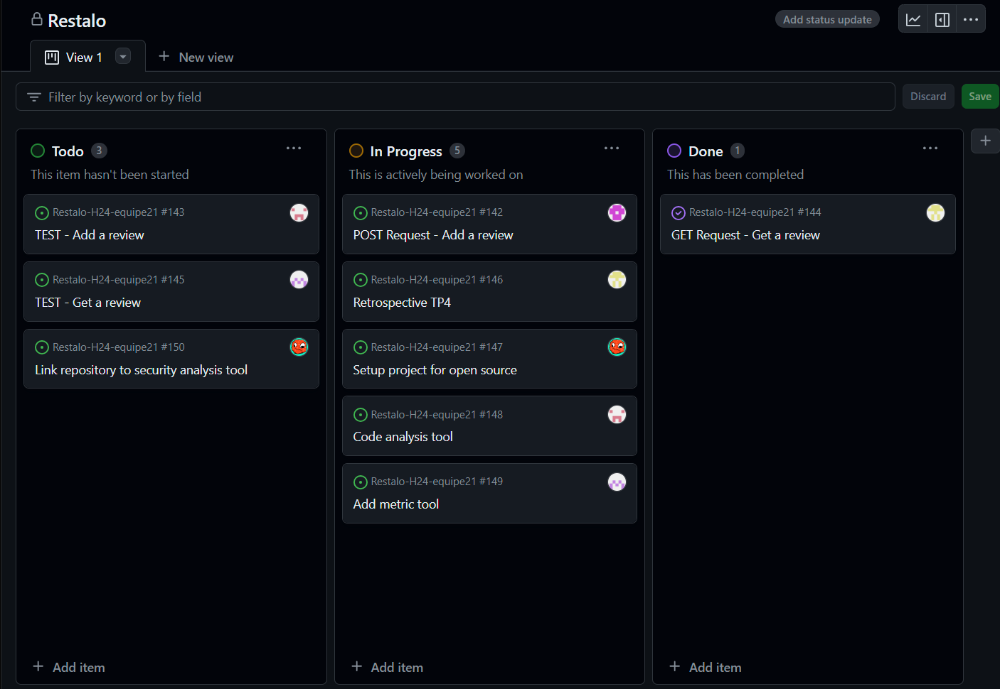

# Exercices - TP4

## Rétrospective finale

### Processus

1. L'une des principales problématiques à notre processus actuel est sans doute le manque de communication entre les 
   membres de l'équipe. Même si nous réalisons des rencontres de mises au point deux fois par semaine, il n'y a 
   pas réellement de communications entre ces moments. Il est donc difficile d'être à jour sur l'avancement du 
   projet, car quelqu'un peut avoir terminé sa partie sans nécessairement en aviser les autres avant la prochaine 
   rencontre. Une autre problématique commune à tous les membres de l'équipe et affectant notre processus est 
   définitivement le manque de temps. Il aurait été préférable de travailler constamment sur le travail, 
   petit-à-petit, plutôt que de le compléter en trois jours la semaine de la remise.
2. À l'annonce d'une nouvelle technologie à utiliser pour le TP, notre premier réflexe a toujours été de chercher de 
   l'information en ligne, que ce soit sur des forums ou dans la documentation officielle. Par la suite, nous 
   pouvions mettre en pratique ces connaissances en intégrant le nouvel outil dans notre _pipeline_. Bien entendu, 
   il n'était pas rare que des bogues surviennent pendant cette démarche. Dans ces cas-là, notre premier réflexe 
   était d'exposer le problème aux autres membres de l'équipe pour obtenir de l'aide. Quelques fois, nous avons 
   également posé des questions sur le forum du cours. Une fois l'outil intégré, nous testions d'abord son 
   fonctionnement manuellement avant de décider s'il était nécessaire d'automatiser ces tests.
3. D'abord, nous sommes fiers d'avoir mis en place et suivis, pendant toute la session, un processus nous aidant 
   dans la réalisation du projet. Cette expérience nous permettra d'être de meilleurs développeurs lors de notre entrée 
   sur le marché du travail (et même avant!). Ensuite, nous sommes satisfaits de la qualité de notre code, car nous 
   considérons qu'il est le plus _clean_ que nous ayons réalisé dans notre parcours jusqu'à maintenant. Enfin, 
   l'architecture de notre système est également quelque chose dont nous sommes fiers. Pendant le projet, nous avons 
   réalisé qu'une bonne architecture et qu'un code simple et lisible simplifient réellement les choses lorsqu'il s'agit 
   d'ajouter une fonctionnalité au système ou de modifier celles déjà existantes.
4. Nous souhaitons que les prochains étudiants qui doivent faire ce projet s'y investissent pleinement, car c'est
   selon nous la meilleure opportunité pour apprendre à bien travailler en équipe depuis le début de notre parcours.
5. L'utilisation des fonctionnalités avancées de GitHub, telles que les _Actions_, nous a permis d'acquérir 
   beaucoup de connaissances qui nous seront utiles plus tard, que ce soit à l'école ou en entreprise. Également, comme 
   mentionné précédemment, les apprentissages que nous avons faits en matière de travail d'équipe et de collaboration 
   sont nombreux et nous donnerons un avantage considérable dans le futur. Cela comprend la mise en place d'un 
   processus, l'utilisation des _Issues_ et des _Pull-requests_, le partage de connaissances, la programmation par 
   les pairs, etc.

### Outils d'intelligence artificielle

1. Dans le cadre de ce cours, une majorité des membres ont utilisé ChatGPT afin d'obtenir de l'aide en programmation.
   Plus souvent qu'autrement, ce n'était pas pour générer du code de zéro que cet outil était utilisé, mais bien 
   pour simplifier du code déjà existant écrit par l'équipe. Dans d'autres cas, ChatGPT servait à améliorer la 
   formulation des textes présents dans les fichiers d'exercices.
2. Le principal avantage de cet outil est la rapidité de génération de réponses. En quelques secondes, ChatGPT peut 
   générer un texte/code qui pourrait demander plusieurs dizaines de minutes de travail à un humain. Il est 
   également très flexible dans les tâches qu'il peut réaliser et peut répondre à un grand nombre de questions 
   assez pointues, sur des librairies de code, par exemple.
3. Il faut rester vigilent lors de l'utilisation de ce genre de technologie, car les réponses données ne sont pas 
   toujours exactes et nécessitent d'être validées par un humain avant d'être utilisées. De plus, l'intelligence 
   artificielle peut devenir néfaste si le développeur en devient dépendant.
4. Afin de développer une intelligence artificielle, il faut des connaissances avancées en programmation et en 
   mathématiques. Pour cette raison, nous sommes convaincus que le monde aura toujours besoin de spécialistes en 
   développement logiciel, si ce n'est que pour maintenir ces nouvelles technologies.

## Open Sourcing

### Contribution externe

#### 1: CODE_OF_CONDUCT
* Nous avons utilisé le template fourni par Contributor Covenant,version 2.1, à
  [Contributor Covenant](https://www.contributor-covenant.org/version/2/1/code_of_conduct.html)
* Pourquoi nous avons utilisé ce template:
    * C'est utilisé par au délà de 40 000 projets open source, parmis lesquels se trouvent des projets très populaires tels que Rails et Swift.
    * Le template recouvre toutes les comportoments non-voulus et les conséquences liés à ceux-ci. Ça clarifie exactement
      les actions que nous devons prendre dans le cas d'une infraction, pour nous ainsi que pour les utilisateurs.


#### 2: LICENSE
* Nous avons utilisé le license de MIT pour notre projet
* 3 raisons principales pourquoi nous avons utilisé ce template:
    * 1. Le license est très permissive, ce que nous voulons parce que nous voulons partager l'utilité de Restalo avec le plus d'utilisateurs possibles.
  Tant qu'on a considéré le license Apache 2.0, le point fort de celui-ci c'est ces permissions d'utilisation de brevets, mais nous n'en avions pas dans le projet,
  donc ce n'est pas nécessaire.
    * 2. Ce license déclare que nous ne sommes pas responsables pour des dommages causés par notre logiciel. Nous ne devons pas souciés de ce genre de trouble légal dans ce cas.
    * 3. Nous avons remarqués que ce license est très souvent utilisé par plusieurs projets réputés. 
  Ce license est donc très crédible et nous donne plus de raison de l'utiliser pour notre projet aussi

#### 3: CONTRIBUTING
* Nous avons utilisé le template fourni par Nayafia à [Nayafia-code_of_conduct](https://www.contributor-covenant.org/version/2/1/code_of_conduct.html)
aussi inspiré par le projet Ruby on Rails à [Rails-code_of_conduct](https://github.com/rails/rails/blob/main/CONTRIBUTING.md)
* Pourquoi nous avons utilisé ce template:
    * Ce template permet de bien accueillir les nouveaux contributeurs ainsi que de bien clarifier ce qui est voulu comme contribution et comment procéder.
    * Lorsque nous clarifions ce que nous voulons comme ça dans le fichier CONTRIBUTION, ça permet d'éviter à gérer des PRs non désiré et d'assurer que les demandes
  de fix ou features se rendent à la bonne place.
    * Aussi, nous avons incorporés quelques idées concernant différents types de pull-request du projet Ruby on Rails. Ça permet d'inclure la plupart des cas où qu'une personne
  voudrais contribuer.


## Sécurité

## Stories

En fonction des commentaires et suggestions de notre correcteur, voici en détails les deux _stories_ que nous avons 
implémentées lors de ce TP.

### Ajouter une évaluation

En tant que client, je peux ajouter une évaluation au restaurant.

#### Critères de succès

- La note doit être comprise entre 0 et 5 inclusivement. La note est un entier.
- Le commentaire ne peut pas être vide.
- Chaque évaluation est horodatée au moment de sa création.

#### Spécifications

##### Requête

**Path**

`POST restaurants/<id>/reviews`

**Body**

```ts
{
  rating: number, // integer between 0 and 5
  comment: string
}
```

##### Réponses

- `201 CREATED`: succès.

- `400 BAD REQUEST`: un des paramètres obligatoires est manquant.

  **Body**

  ```ts
  {
    error: "MISSING_PARAMETER",
    description: string
  }
  ```

- `400 BAD REQUEST`: un des paramètres n'est pas valide.

  **Body**

  ```ts
  {
    error: "INVALID_PARAMETER",
    description: string
  }
  ```

- `404 NOT FOUND`: le restaurant n'existe pas.

### Rechercher des évaluations

En tant qu'utilisateur, je peux voir les évaluations d'un restaurant.

#### Critères de succès

- Il est possible de rechercher par notes. Une note est un entier entre 0 et 5 inclusivement.
- Il est possible de rechercher par intervalle de dates.
- On peut combiner les deux paramètres de recherche.
- Si aucun paramètre n'est spécifié, toutes les évaluations du restaurant sont affichées.
- L'ordre d'affichage des évaluations n'a pas d'importance, tant qu'elles respectent les paramètres de recherche.

#### Spécifications

##### Requête

**Path**

`GET restaurants/<id>/reviews?<queryParams>`

**Query params**

- `rating?: string`
- `from?: string  // date without timezone (ISO)`
- `to?: string  // date without timezone (ISO)`

**Exemples**

- `GET restaurants/<id>/reviews`
- `GET restaurants/<id>/reviews?rating=2`
- `GET restaurants/<id>/reviews?rating=1&rating=2&rating=3`
- `GET restaurants/<id>/reviews?from=2023-03-16`
- `GET restaurants/<id>/reviews?from=2023-03-16&to=2024-03-16`
- `GET restaurants/<id>/reviews?from=2023-03-16&to=2023-12-31&rating=1&rating=4`

#### Réponses
- `200 OK`: succès.

  **Body**

  ```ts
  [
    {
      id: string,
      rating: string,
      comment: string,
      date: string //date without timezone (ISO)
    },
    ...
  ]
  ```

- `400 BAD REQUEST`: un des paramètres n'est pas valide.

  **Body**

  ```ts
  {
    error: "INVALID_PARAMETER",
    description: string
  }
  ```

- `404 NOT FOUND`: le restaurant n'existe pas.

## Architecture

## Planification du travail

### GitHub Project


### Milestone


### Issues

Issue #1


Issue #2


Issue #3


### Pull requests

Pull request #1


Pull request #2


Pull request #3


### Arbre de commits


